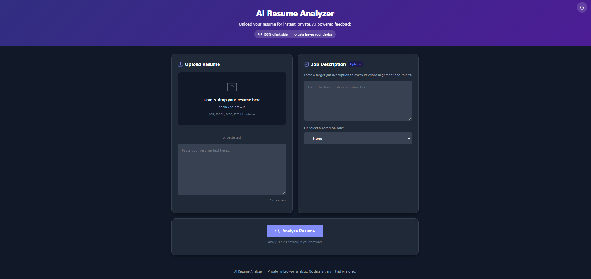
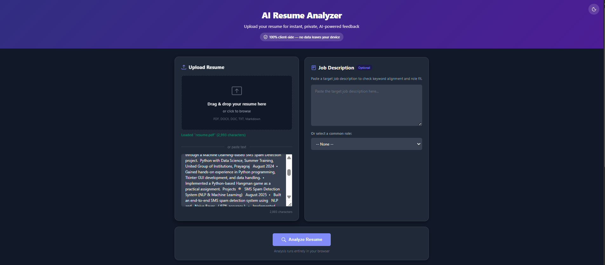
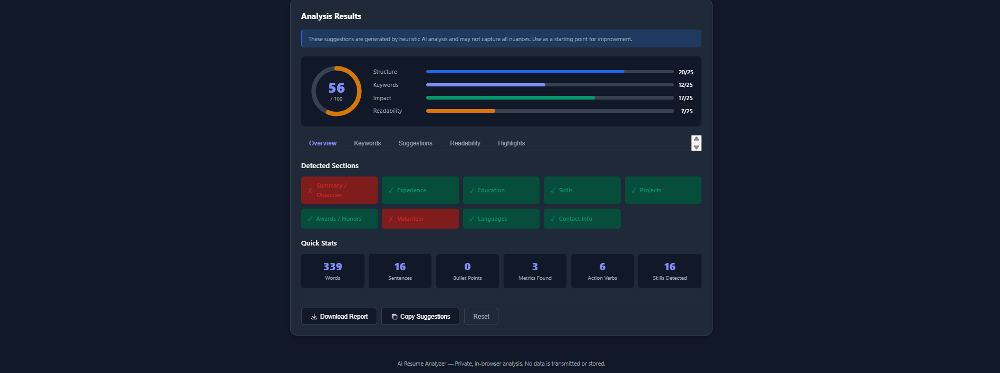

# 🧠 AI Resume Analyzer

A **fully client-side AI-powered resume analyzer** built with **HTML, CSS, and Vanilla JavaScript**.

The application performs resume parsing, skill detection, keyword analysis, and generates actionable suggestions — **all inside the browser with zero server processing**.

---

## 🌐 Live Demo

You can try the application live here:

🔗 **Live Application:**  
https://ai-resume-analyzer-gamma-ashy.vercel.app/

## 🚀 Features

### ✨ Dynamic User Experience
- Holographic **AI scanning animation**
- Smooth **toast notification system**
- **Confetti celebration** for high scores
- Hover animations and floating UI cards
- Animated tab transitions

### 🧠 Resume Intelligence
- Skill detection
- Keyword analysis
- Action verb detection
- Resume score calculation
- Suggestions engine

### 💾 Smart Browser Features
- **LocalStorage auto-save**
- Resume & job description drafts persist
- Works **fully offline**

### 📂 File Support
- PDF
- DOCX
- TXT

All parsing happens **inside the browser**.

---

# 📦 Project Structure
```
AI-Resume-Analyzer/
│
├── index.html
├── styles.css
├── favicon.png
├── script.js
└── README.md
```
---

## 📸 Screenshots

### Dashboard UI



### Resume Upload



### Analysis Results



---

# ⚙️ Run Locally

Clone the repository.

```bash
git clone https://github.com/yourusername/ai-resume-analyzer.git
```
Move into the project directory
```bash
cd ai-resume-analyzer
```
Open the project in your browser
```
start index.html
```
Or run a simple local server
```
python -m http.server 5500
```
Then visit:
```
http://localhost:5500
```
# 🧪 Development Workflow

Install dependencies (optional if using local server tools).
```
npm install
```
Run development server.
```
npm run dev
```
# 🌐 Deployment

This project can be deployed instantly on Vercel.
```
git add .
git commit -m "deploy resume analyzer"
git push
```
Then connect the GitHub repository to Vercel.

# 🔒 Privacy

✔ No backend
✔ No external APIs
✔ No data storage
✔ Everything processed locally in the browser

# 🧠 Advanced UI Mechanics

✔ Dynamic Resume Scanner
✔ Simulates AI scanning the resume using animated scan-line overlays.
✔ Real-time Auto Save
✔ All text inputs persist using localStorage.
✔ Keyword & Action Verb Highlights
✔ Regex based highlighting:
✔ Blue → Job keywords
✔ Green → Action verbs
✔ Confetti Success Animation
✔ Triggered when resume score exceeds 80/100.
✔ Toast Notification System
✔ Smooth notification system replacing alerts.

# 📱 Responsive Design

The UI adapts for:

✔ Desktop
✔ Tablet
✔ Mobile
Using modern CSS Grid + Flexbox layouts.

# 🛠 Tech Stack
HTML5
CSS3
Vanilla JavaScript
pdf.js
mammoth.js

# 👨‍💻 Author

Abdul Samad

B.Tech Student
AI & Web Development Projects

