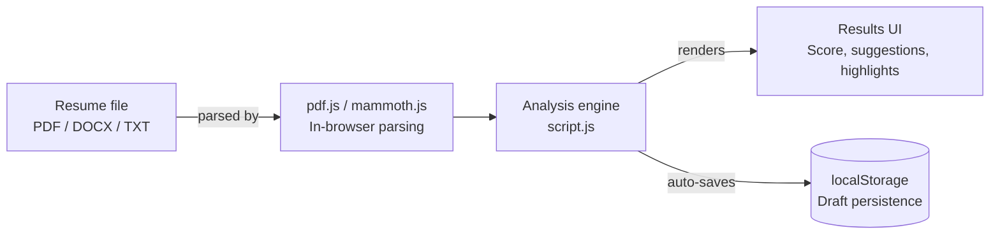
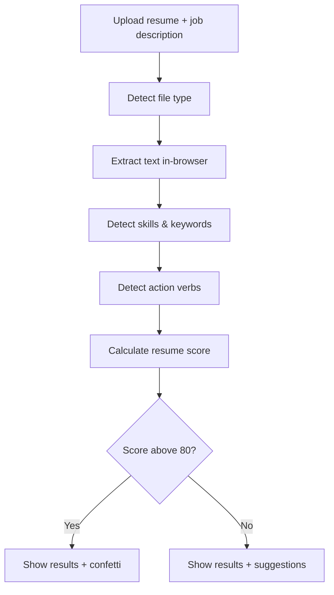
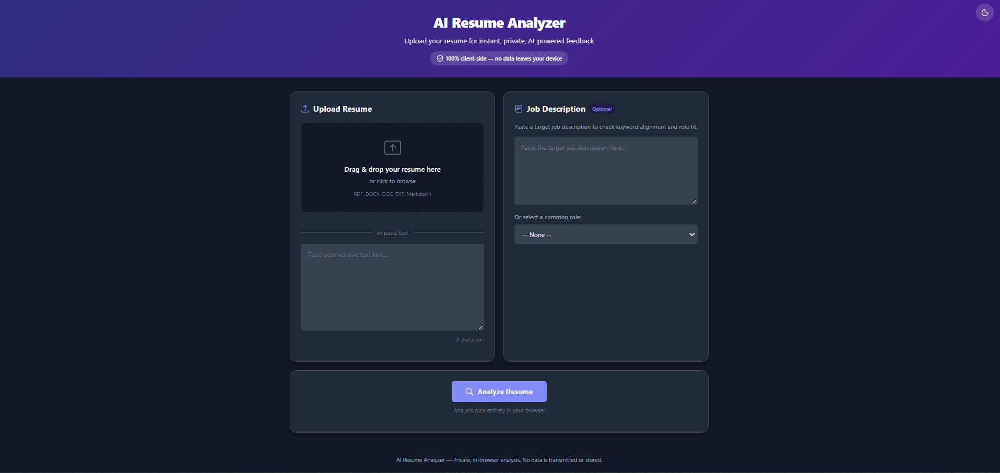
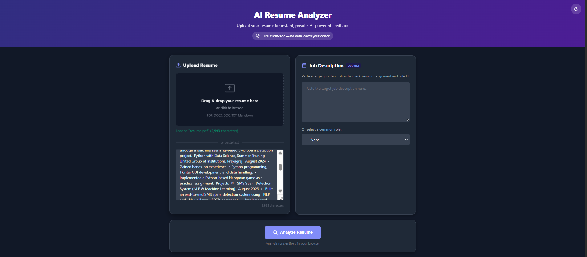
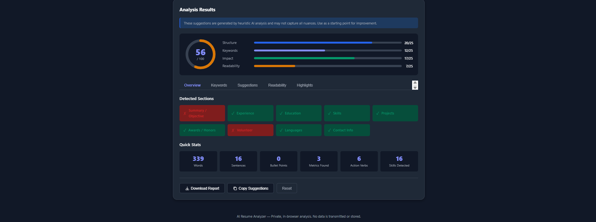

# 🧠 AI Resume Analyzer

[](https://developer.mozilla.org/en-US/docs/Web/HTML)
[](https://developer.mozilla.org/en-US/docs/Web/CSS)
[](https://developer.mozilla.org/en-US/docs/Web/JavaScript)
[](https://ai-resume-analyzer-gamma-ashy.vercel.app/)
[](#license)

A fully client-side, AI-styled resume analyzer built with **HTML, CSS, and vanilla JavaScript**. It parses resumes, detects skills and keywords, and generates actionable suggestions — entirely inside the browser, with zero server processing.

**🔗 Live Demo:** [ai-resume-analyzer-gamma-ashy.vercel.app](https://ai-resume-analyzer-gamma-ashy.vercel.app/)
  
---

## Table of Contents

- [Overview](#overview)
- [Architecture](#architecture)
- [Analysis Workflow](#analysis-workflow)
- [Features](#features)
- [Tech Stack](#tech-stack)
- [Project Structure](#project-structure)
- [Getting Started](#getting-started)
- [Privacy](#privacy)
- [Advanced UI Mechanics](#advanced-ui-mechanics)
- [Responsive Design](#responsive-design)
- [Screenshots](#screenshots)
- [Deployment](#deployment)
- [Limitations](#limitations)
- [Contributing](#contributing)
- [License](#license)
- [Author](#author)

---

## Overview

Upload a resume (PDF, DOCX, or TXT) alongside a job description, and the analyzer extracts text in-browser, detects relevant skills and keywords, scores the resume, and surfaces concrete suggestions — all without the file ever leaving the device.

## Architecture


```mermaid
flowchart LR
    A[Resume file<br/>PDF / DOCX / TXT] -->|parsed by| B[pdf.js / mammoth.js<br/>In-browser parsing]
    B --> C[Analysis engine<br/>script.js]
    C -->|renders| D[Results UI<br/>Score, suggestions, highlights]
    C -->|auto-saves| E[(localStorage<br/>Draft persistence)]
```

There's no backend in this architecture — parsing, analysis, and scoring all run as client-side JavaScript, and the only persistence layer is the browser's own `localStorage`.

## Analysis Workflow


```mermaid
flowchart TD
    A[Upload resume + job description] --> B[Detect file type]
    B --> C[Extract text in-browser]
    C --> D[Detect skills & keywords]
    D --> E[Detect action verbs]
    E --> F[Calculate resume score]
    F --> G{Score above 80?}
    G -->|Yes| H[Show results + confetti]
    G -->|No| I[Show results + suggestions]
```

## Features

### Dynamic User Experience
- Holographic AI scanning animation
- Smooth toast notification system
- Confetti celebration for high scores
- Hover animations and floating UI cards
- Animated tab transitions

### Resume Intelligence
- Skill detection
- Keyword analysis
- Action verb detection
- Resume score calculation
- Suggestions engine

### Smart Browser Features
- `localStorage` auto-save
- Resume and job description drafts persist across sessions
- Works fully offline

### File Support
- PDF
- DOCX
- TXT

All parsing happens inside the browser — no file is ever uploaded to a server.

## Tech Stack

| Layer | Technologies |
|---|---|
| Structure | HTML5 |
| Styling | CSS3 (Grid + Flexbox) |
| Logic | Vanilla JavaScript |
| File Parsing | pdf.js, mammoth.js |
| Deployment | Vercel |

## Project Structure

```
AI-Resume-Analyzer/
├── index.html
├── styles.css
├── favicon.png
├── script.js
└── README.md
```

## Getting Started

### Option 1 — open directly
```bash
git clone https://github.com/abdul-samad-001/ai-resume-analyzer.git
cd ai-resume-analyzer
start index.html
```

### Option 2 — run a local static server
```bash
python -m http.server 5500
```
Then visit [http://localhost:5500](http://localhost:5500).

No build step, package manager, or dependencies are required — this is a static site.

## Privacy

- ✔ No backend
- ✔ No external APIs
- ✔ No data storage outside the browser
- ✔ Everything is processed locally on-device

## Advanced UI Mechanics

- **Dynamic resume scanner** — animated scan-line overlay simulating an AI scan
- **Real-time auto-save** — all text inputs persist via `localStorage`
- **Keyword & action verb highlighting** — regex-based, blue for job keywords, green for action verbs
- **Confetti success animation** — triggered when the resume score exceeds 80/100
- **Toast notification system** — replaces native browser alerts

## Responsive Design

The UI adapts across desktop, tablet, and mobile using modern CSS Grid and Flexbox layouts.

## Screenshots

| Dashboard | Resume Upload | Analysis Results |
|---|---|---|
|  |  |  |

## Deployment

This project deploys instantly on Vercel as a static site:

```bash
git add .
git commit -m "deploy resume analyzer"
git push
```

Then connect the GitHub repository to Vercel — no build configuration is needed since there's no bundler in this project.

## Limitations

- Parsing accuracy depends on the source file's formatting — complex PDF layouts (multi-column, heavy graphics) may extract text less reliably than plain-text resumes.
- Drafts persist via `localStorage`, which is per-browser and per-device — there's no account system or cross-device sync.
- Keyword and skill matching is regex/rule-based rather than a trained NLP model, so results are best treated as directional guidance rather than a definitive score.

## Contributing

Contributions are welcome. Please open an issue to discuss a change before submitting a pull request, and keep PRs focused on a single improvement or fix.

## License

This project is licensed under the MIT License. See the [LICENSE](LICENSE) file for details.

## Author

**Abdul Samad**
B.Tech Student — AI & Web Development Projects
